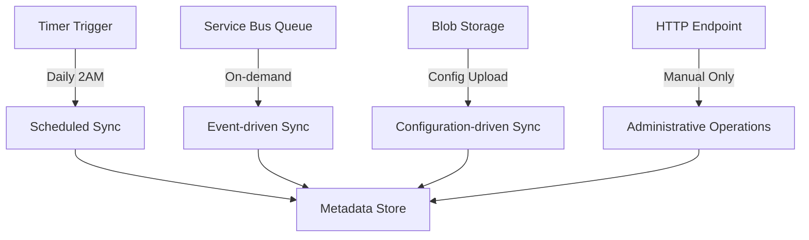

# Azure Functions Triggers for Metadata Synchronization

This document explains the different Azure Functions trigger types and their optimal use cases for Microsoft Update metadata synchronization.

## Why Different Triggers Matter

The original HTTP trigger approach treats metadata sync as a **request/response operation**, but metadata synchronization is actually a **long-running background process**. Here's why different triggers are better:

### ❌ **HTTP Trigger Limitations**
- **Timeout constraints**: HTTP requests timeout (typically 5-10 minutes)
- **Synchronous operation**: Client must wait for completion
- **No retry logic**: Failed requests require manual retry
- **Resource waste**: Keeps connection open during long operations
- **Scaling issues**: Each sync operation consumes an HTTP worker

### ✅ **Better Trigger Alternatives**

## 1. Timer Trigger (Recommended for Scheduled Operations)

**Best for**: Regular, automated synchronization

```csharp
[Function("ScheduledMetadataSync")]
public async Task RunScheduledMetadataSync([TimerTrigger("0 0 2 * * *")] TimerInfo timer)
{
    // Runs daily at 2 AM UTC
    await SyncMetadataFromUpstream();
}
```

**Benefits**:
- ✅ **Reliable scheduling**: CRON expressions for precise timing
- ✅ **No timeout limits**: Can run for hours if needed
- ✅ **Automatic retry**: Built-in retry policies
- ✅ **No client waiting**: Fire-and-forget operation
- ✅ **Resource efficient**: No HTTP overhead

**Use Cases**:
- Daily security update synchronization
- Weekly full catalog refresh
- Monthly cleanup operations
- Scheduled maintenance tasks

**CRON Examples**:
```csharp
"0 0 2 * * *"     // Daily at 2 AM UTC
"0 0 1 * * 0"     // Weekly on Sunday at 1 AM UTC  
"0 0 3 1 * *"     // Monthly on 1st at 3 AM UTC
"0 */4 * * * *"   // Every 4 hours
```

## 2. Service Bus Trigger (Recommended for Event-Driven Operations)

**Best for**: On-demand, parameterized synchronization

```csharp
[Function("ProcessMetadataSyncRequest")]
public async Task ProcessSyncRequest([ServiceBusTrigger("metadata-sync-requests")] string requestMessage)
{
    var syncRequest = JsonSerializer.Deserialize<MetadataSyncRequest>(requestMessage);
    await ProcessSyncRequest(syncRequest);
}
```

**Benefits**:
- ✅ **Decoupled architecture**: Producers and consumers are independent
- ✅ **Guaranteed delivery**: Messages persist until processed
- ✅ **Dead letter handling**: Failed messages go to dead letter queue
- ✅ **Load balancing**: Multiple function instances can process queue
- ✅ **Backpressure handling**: Queue prevents overwhelming the system

**Use Cases**:
- Administrator-initiated sync operations
- API-triggered synchronization requests
- Workflow-driven metadata updates
- Integration with external systems

**Message Example**:
```json
{
  "syncType": "updates",
  "upstreamEndpoint": "https://custom-wsus.domain.com",
  "productsFilter": ["Windows 10", "Windows 11"],
  "classificationsFilter": ["Security Updates"],
  "maxItems": 100,
  "skipSuperseded": true
}
```

## 3. Blob Storage Trigger (Recommended for Configuration-Driven Operations)

**Best for**: Configuration file-based synchronization

```csharp
[Function("ProcessSyncConfigFile")]
public async Task ProcessConfigFile([BlobTrigger("metadata-config/{name}")] Stream configStream, string name)
{
    var config = JsonSerializer.Deserialize<MetadataSyncConfiguration>(configStream);
    await ProcessConfiguration(config);
}
```

**Benefits**:
- ✅ **Configuration as code**: Sync definitions in version control
- ✅ **Batch operations**: Multiple sync operations in one file
- ✅ **Audit trail**: File history shows what was synchronized when
- ✅ **GitOps integration**: Changes trigger via CI/CD pipelines

**Use Cases**:
- DevOps-driven synchronization workflows
- Multi-environment sync configurations
- Batch processing multiple sync types
- Compliance-driven sync schedules

**Configuration Example**:
```json
{
  "operations": [
    {
      "type": "categories",
      "upstreamEndpoint": "https://sws.update.microsoft.com",
      "maxItems": 100
    },
    {
      "type": "updates",
      "productsFilter": ["Windows 10"],
      "classificationsFilter": ["Security Updates"],
      "skipSuperseded": true,
      "maxItems": 50
    }
  ]
}
```

## 4. HTTP Trigger (Use Sparingly for Administrative Operations)

**Best for**: Manual operations and health checks only

```csharp
[Function("ManualMetadataSync")]
public async Task<HttpResponseData> ManualSync([HttpTrigger(AuthorizationLevel.Function, "post")] HttpRequestData req)
{
    // Use only for quick administrative operations
    var options = JsonSerializer.Deserialize<ManualSyncRequest>(await req.ReadAsStringAsync());
    return await ProcessManualRequest(options);
}
```

**When to use HTTP triggers**:
- ✅ Health check endpoints
- ✅ Quick status queries
- ✅ Emergency manual triggers
- ✅ Administrative operations

**When NOT to use HTTP triggers**:
- ❌ Long-running synchronization operations
- ❌ Scheduled/regular sync tasks
- ❌ High-volume batch operations
- ❌ Production automation workflows

## Recommended Architecture

### Production Setup


### Function Responsibilities

| Trigger Type | Purpose | Frequency | Timeout | Retry Logic |
|--------------|---------|-----------|---------|-------------|
| **Timer** | Automated sync | Daily/Weekly | Unlimited | Built-in |
| **Service Bus** | On-demand sync | As needed | Unlimited | Dead letter queue |
| **Blob** | Config-driven sync | On file upload | Unlimited | Built-in |
| **HTTP** | Manual admin ops | Rare | 5-10 minutes | Manual only |

## Migration from HTTP Triggers

### Step 1: Create Timer Functions
Replace your scheduled HTTP calls with timer triggers:

```csharp
// OLD: HTTP endpoint called by external scheduler
[Function("HttpMetadataSync")]
public async Task<HttpResponseData> SyncViaHttp([HttpTrigger] HttpRequestData req)

// NEW: Built-in timer scheduling
[Function("ScheduledMetadataSync")]
public async Task SyncViaTimer([TimerTrigger("0 0 2 * * *")] TimerInfo timer)
```

### Step 2: Add Service Bus for Dynamic Operations
For parameterized sync requests:

```csharp
// Send message to queue instead of HTTP call
var serviceBusClient = new ServiceBusClient(connectionString);
var sender = serviceBusClient.CreateSender("metadata-sync-requests");
await sender.SendMessageAsync(new ServiceBusMessage(JsonSerializer.Serialize(syncRequest)));
```

### Step 3: Keep Minimal HTTP Endpoints
Retain HTTP only for true administrative needs:

```csharp
[Function("GetSyncStatus")]
public async Task<HttpResponseData> GetStatus([HttpTrigger] HttpRequestData req)
{
    // Quick status check only
    return CreateStatusResponse();
}
```

## System.Text.Json vs Newtonsoft.Json

### Why System.Text.Json is Better

✅ **Performance**: 2-3x faster serialization
✅ **Memory efficient**: Lower memory allocation
✅ **Security**: Built-in security features
✅ **AOT compatible**: Works with Native AOT
✅ **Modern**: Active development and support

### Migration Examples

```csharp
// OLD: Newtonsoft.Json
using Newtonsoft.Json;
var json = JsonConvert.SerializeObject(obj);
var obj = JsonConvert.DeserializeObject<MyType>(json);

// NEW: System.Text.Json
using System.Text.Json;
var json = JsonSerializer.Serialize(obj);
var obj = JsonSerializer.Deserialize<MyType>(json);
```

### Configuration for Azure Functions

```csharp
public static void Main()
{
    var host = new HostBuilder()
        .ConfigureFunctionsWorkerDefaults(builder =>
        {
            builder.Services.Configure<JsonSerializerOptions>(options =>
            {
                options.PropertyNamingPolicy = JsonNamingPolicy.CamelCase;
                options.WriteIndented = true;
            });
        })
        .Build();

    host.Run();
}
```

## Best Practices Summary

### ✅ Do
- Use **Timer triggers** for scheduled operations
- Use **Service Bus triggers** for event-driven operations  
- Use **Blob triggers** for configuration-driven operations
- Use **System.Text.Json** for serialization
- Use **`this` keyword** for field access
- Implement proper error handling and retry logic
- Add comprehensive logging

### ❌ Don't
- Use HTTP triggers for long-running operations
- Use Newtonsoft.Json in new code
- Ignore timeout and retry considerations
- Mix trigger types without clear separation of concerns
- Forget to implement dead letter queue handling

This architecture provides a robust, scalable, and maintainable solution for Microsoft Update metadata synchronization using appropriate Azure Functions triggers for each use case.