# Update Server Architectural Overview

This document details architectural concepts, workflows, and visualizations for the `update-server-server-sync` repository. It aims to assist contributors, maintainers, and users in understanding how the update pipeline works and how the system remains available during updates.

---

## Table of Contents

- [High-Level Data Flow](#high-level-data-flow)
- [Lifecycle Diagram](#lifecycle-diagram)
- [Error Handling and Retry Flow](#error-handling-and-retry-flow)
- [Component Diagram](#component-diagram)
- [Sequence Diagram](#sequence-diagram)
- [Storage Layouts](#storage-layouts)
- [Synchronization Scenarios](#synchronization-scenarios)
- [API Usage](#api-usage)
- [Concurrency & Locking](#concurrency--locking)
- [Extensibility Layer](#extensibility-layer)
- [Update Object Relationships](#update-object-relationships)
- [Zero-Downtime Updating](#zero-downtime-updating)
- [Decision Table](#decision-table)

---

## High-Level Data Flow

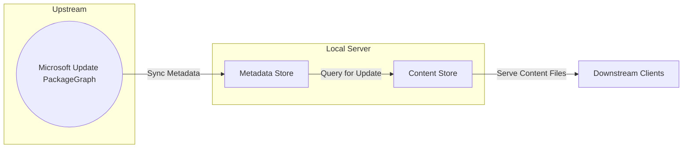

---

## Lifecycle Diagram

Shows the lifecycle of an update from remote sync to client serving.

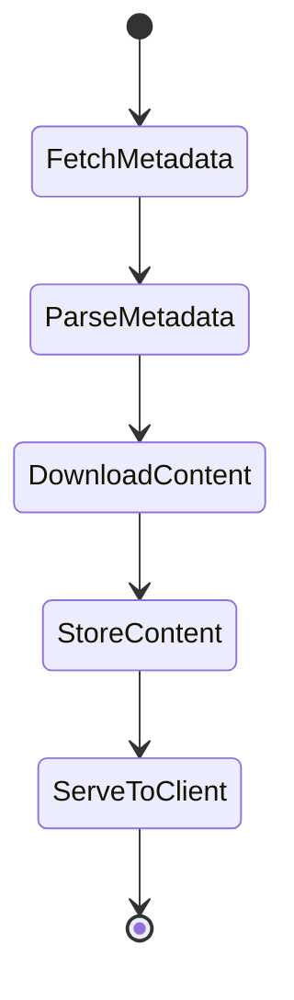

---

## Error Handling and Retry Flow

Visualizes error management and retries during download/update operations.

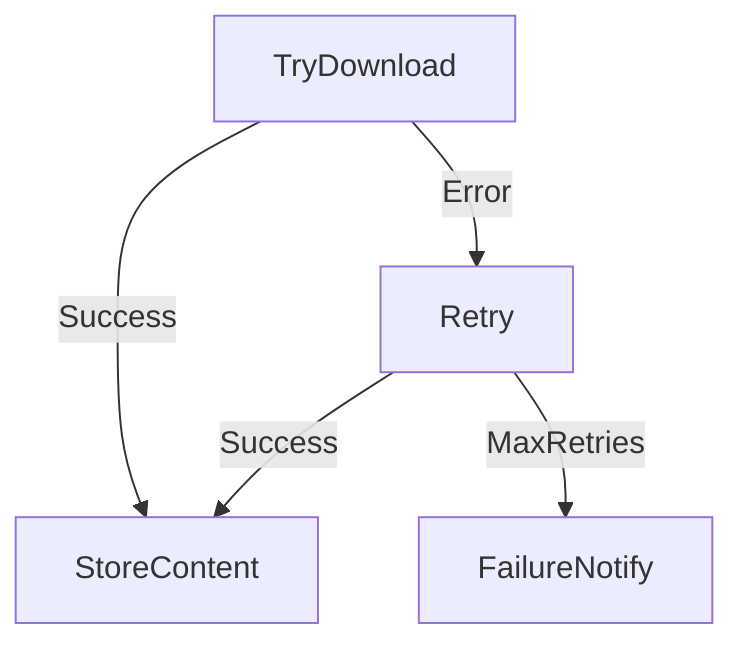

---

## Component Diagram

Displays the core interfaces and implementations.

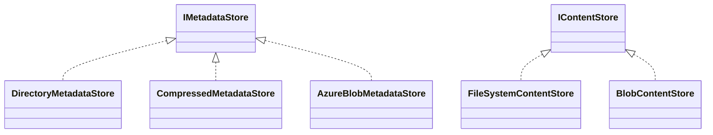

---

## Sequence Diagram

Typical client interaction for update query and content download.

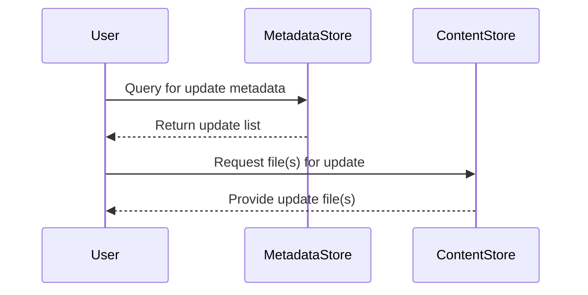

---

## Storage Layouts

### Metadata Store

```
store/
└── metadata/
    └── partitions/
        └── [partition]/
            └── [index]/
                └── [updateId].xml
```

### Content Store

```
content/
└── [updateId]/
    └── [actual file]
```

---

## Synchronization Scenarios

Demonstrates upstream sync and multi-client serving.

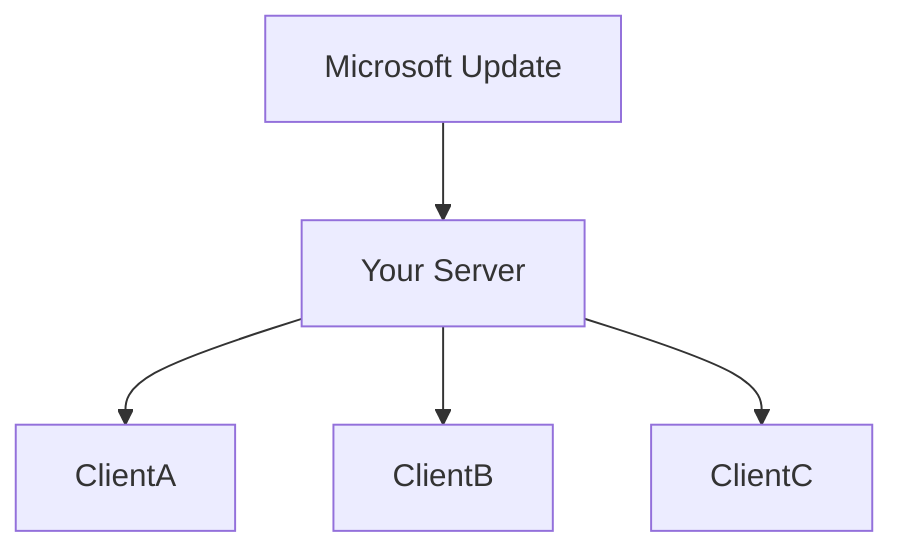

---

## API Usage

Primary classes and entry points for common user operations.

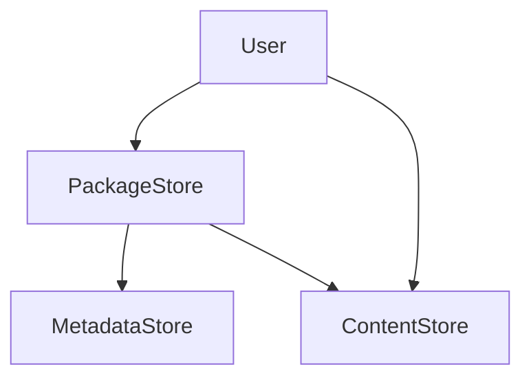

---

## Concurrency & Locking

Critical for zero-downtime updates, thread safety is achieved via locks and atomic swaps.

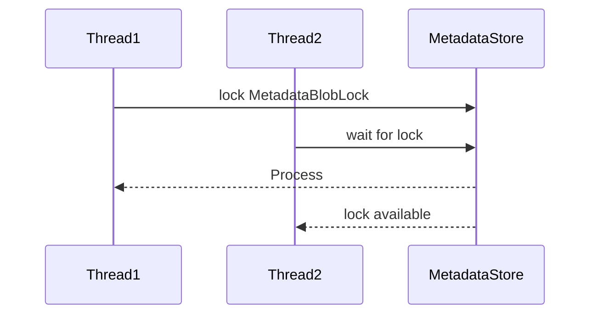

---

## Extensibility Layer

Supports adding new metadata/content store providers.

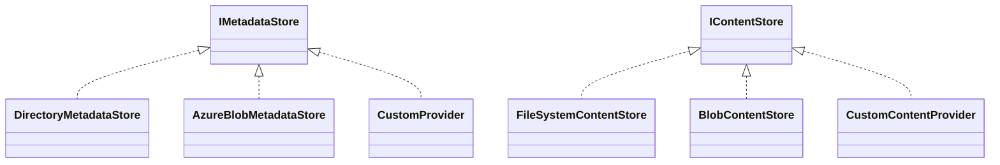

---

## Update Object Relationships

How updates, KBs, and requirements interact.

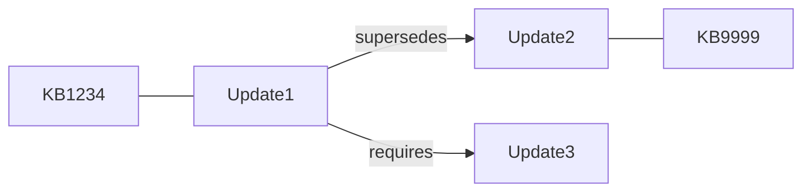

---

## Zero-Downtime Updating

**How metadata and content are updated while serving clients:**

- **Background sync:** Run fetch/update jobs periodically in background threads or processes.
- **Staging areas:** Sync new metadata/content to temporary storage, not affecting current service.
- **Atomic swaps:** Swap files/indices with new versions only after sync completes.
- **Locking/concurrency:** `ReaderWriterLockSlim` or `object locks` (see repo code) prevent serving partial/inconsistent data.
- **Versioning:** Retain prior content or metadata while client requests are in-flight.
- **Indexation:** Reindex new metadata/content in the background, swapping only after health checks.
- **Failover:** If update fails, old versions are retained for uninterrupted client service.

### Fast Update Sequence

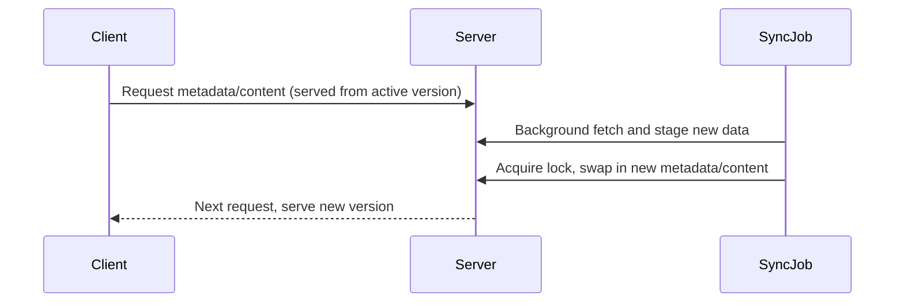

---

## Decision Table

| Use Case                | Metadata Store Backend      | Content Store Backend   | Pros                  | Cons                      |
|-------------------------|----------------------------|------------------------|-----------------------|---------------------------|
| Small/local deployment  | DirectoryMetadataStore     | FileSystemContentStore | Easy, fast filesystem | Not cloud-scalable        |
| Cloud/distributed       | AzureBlobMetadataStore     | BlobContentStore       | Cloud-based, scalable | Needs setup, network cost |
| Compressed archive      | CompressedMetadataStore    | FileSystemContentStore | One file, portable    | Slower queries            |

---

## References & Further Reading

- [IMetadataStore API documentation](docs/api/Microsoft.PackageGraph.Storage.IMetadataStore.html)
- [IContentStore API documentation](docs/api/Microsoft.PackageGraph.Storage.IContentStore.html)
- [Example: fetching and storing content](src/documentation/docfx-config/examples/content-store.md)
- Source files:
  - [MetadataStore (Azure)](src/microsoft-update-partition/Storage/AzureBlob/MetadataStore.cs)
  - [DirectoryMetadataStore (Filesystem)](src/microsoft-update-partition/Storage/FileSystem/DirectoryMetadataStore.cs)
  - [FileSystemContentStore](src/microsoft-update-partition/Storage/FileSystem/FileSystemContentStore.cs)
  - [BlobContentStore (Azure)](src/microsoft-update-partition/Storage/AzureBlob/BlobContentStore.cs)

---

## License

MIT
