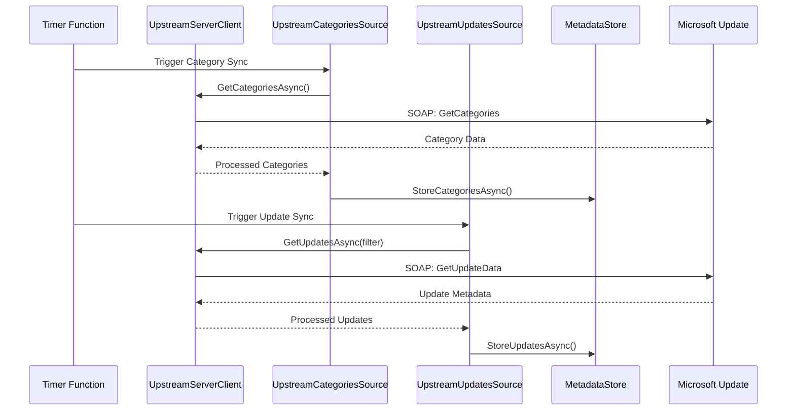
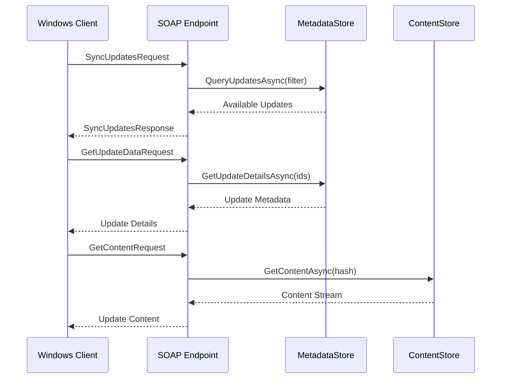
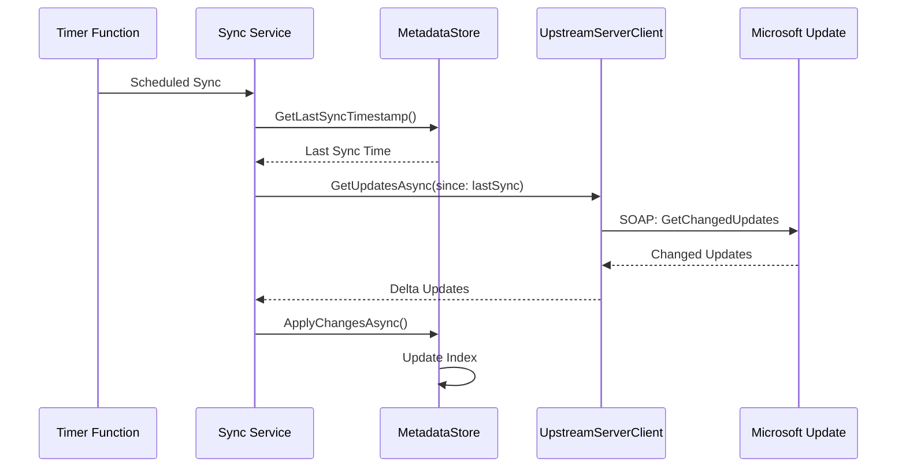

# Data Flow Architecture Guide

## Overview

This guide explains the complete data flow architecture for the Microsoft Update Server-Server Sync implementation, detailing how metadata and content flows from Microsoft's update catalog through the local synchronization services to downstream Windows Update clients and WSUS servers.

## High-Level Architecture

```
Microsoft Update Catalog → UpstreamServerClient → Local Storage → SOAP Endpoints → Downstream Clients
         │                        │                    │              │                   │
    ┌────▼────┐              ┌────▼────┐          ┌────▼────┐    ┌────▼────┐        ┌────▼────┐
    │ Updates │              │ Metadata│          │ Metadata│    │  SOAP   │        │ Windows │
    │Categories│              │  Sync   │          │  Store  │    │Services │        │ Update  │
    │ Content │              │ Service │          │ Content │    │         │        │ Clients │
    └─────────┘              └─────────┘          │  Store  │    └─────────┘        │  WSUS   │
                                                  └─────────┘                       └─────────┘
```

## Core Components

### 1. Microsoft Update Catalog (Upstream)

**Description**: Microsoft's authoritative source for Windows updates, drivers, and security patches.

**Endpoints**:
- **Production**: `https://www.update.microsoft.com/v6/ClientWebService/client.asmx`
- **Configuration**: `https://www.update.microsoft.com/v6/ServerSyncWebService/serversyncwebservice.asmx`

**Data Types**:
- **Updates**: Security patches, feature updates, drivers
- **Categories**: Product classifications (Windows 10, Office, SQL Server)
- **Metadata**: Update descriptions, applicability rules, deployment metadata
- **Content**: Actual update files (.msu, .cab, .exe)

### 2. UpstreamServerClient (Synchronization Layer)

**Purpose**: Handles communication with Microsoft Update services and manages the synchronization process.

#### UpstreamServerClient Architecture

```csharp
public class UpstreamServerClient
{
    // Configuration and authentication
    private readonly Endpoint endpoint;
    private readonly AuthenticationManager authManager;
    
    // Core sync methods
    public async Task<ServerSyncInfo> GetServerConfigData()
    public async Task<UpdateIdentity[]> GetUpdateData(UpdateQuery query)
    public async Task<Stream> GetContentAsync(string contentHash)
}
```

#### Key Responsibilities

1. **Authentication Management**
   - Handles server registration with Microsoft
   - Manages authentication tokens and refresh cycles
   - Implements retry logic for authentication failures

2. **Metadata Synchronization**
   - Fetches update metadata in batches
   - Processes update classifications and categories
   - Handles incremental synchronization

3. **Content Download Management**
   - Downloads actual update files
   - Implements resume functionality for large files
   - Validates content integrity using hashes

### 3. UpstreamCategoriesSource

**Purpose**: Specialized component for synchronizing product categories and classifications.

```csharp
public class UpstreamCategoriesSource : IMetadataSource
{
    public async Task CopyTo(IMetadataStore destination, CancellationToken cancellationToken)
    {
        // 1. Fetch category tree from upstream
        var categories = await this.upstreamClient.GetCategoriesAsync();
        
        // 2. Process category hierarchy
        var processedCategories = this.ProcessCategoryHierarchy(categories);
        
        // 3. Store in local metadata store
        await destination.StoreCategoriesAsync(processedCategories, cancellationToken);
    }
}
```

#### Category Data Flow

```
Microsoft Update Categories → UpstreamCategoriesSource → IMetadataStore
    │                              │                        │
    │ - Product Classifications    │ - Hierarchy Processing  │ - Indexed Storage
    │ - Product Families          │ - Metadata Extraction   │ - Query Optimization
    │ - Update Classifications    │ - Validation            │ - Relationship Mapping
```

### 4. UpstreamUpdatesSource

**Purpose**: Handles synchronization of update metadata and manages the bulk of the synchronization workload.

```csharp
public class UpstreamUpdatesSource : IMetadataSource
{
    public async Task CopyTo(IMetadataStore destination, QueryFilter filter, CancellationToken cancellationToken)
    {
        // 1. Build query from filter
        var query = this.queryBuilder.BuildQuery(filter);
        
        // 2. Fetch updates in parallel batches
        await foreach (var updateBatch in this.GetUpdateBatchesAsync(query, cancellationToken))
        {
            // 3. Process and validate updates
            var processedUpdates = await this.ProcessUpdateBatch(updateBatch);
            
            // 4. Store in metadata store
            await destination.StoreUpdatesAsync(processedUpdates, cancellationToken);
        }
    }
}
```

#### Update Synchronization Flow

```
Query Filter → Query Builder → Batch Fetcher → Update Processor → Metadata Store
     │              │              │                │                 │
     │ - Products    │ - SOAP Query │ - Parallel     │ - Validation    │ - Indexed
     │ - Categories  │ - Pagination │   Processing   │ - Metadata      │   Storage
     │ - Languages   │ - Filtering  │ - Rate Limiting│   Extraction    │ - Search
     │ - Date Range  │             │ - Error Handling│ - Transformation│   Optimization
```

## Storage Architecture

### 5. IMetadataStore Interface

**Purpose**: Provides unified interface for metadata storage across different backends (local file system, Azure Blob Storage).

```csharp
public interface IMetadataStore
{
    // Update management
    Task StoreUpdatesAsync(IEnumerable<Update> updates, CancellationToken cancellationToken);
    Task<Update?> GetUpdateAsync(UpdateIdentity identity, CancellationToken cancellationToken);
    IAsyncEnumerable<Update> GetUpdatesAsync(QueryFilter filter, CancellationToken cancellationToken);
    
    // Category management
    Task StoreCategoriesAsync(IEnumerable<Category> categories, CancellationToken cancellationToken);
    Task<Category?> GetCategoryAsync(Guid categoryId, CancellationToken cancellationToken);
    
    // Search and indexing
    Task<SearchResult> SearchUpdatesAsync(string searchTerm, CancellationToken cancellationToken);
    Task ReindexAsync(CancellationToken cancellationToken);
}
```

#### Storage Implementations

**Local File System (PackageStore)**:
```
./store/
├── index/                  # Search indexes and metadata
│   ├── updates.idx
│   ├── categories.idx
│   └── search.idx
├── updates/               # Individual update metadata
│   ├── {update-id-1}.json
│   ├── {update-id-2}.json
│   └── ...
├── categories/           # Category definitions
│   ├── {category-id-1}.json
│   └── ...
└── metadata.json        # Store configuration and statistics
```

**Azure Blob Storage**:
```
Container: metadata-store
├── index/
│   ├── updates.idx
│   ├── categories.idx
│   └── search.idx
├── updates/
│   ├── partition-2024-01/
│   ├── partition-2024-02/
│   └── ...
└── categories/
```

### 6. IContentStore Interface

**Purpose**: Manages storage and retrieval of actual update content files.

```csharp
public interface IContentStore
{
    // Content storage
    Task StoreContentAsync(string contentHash, Stream content, CancellationToken cancellationToken);
    Task<Stream?> GetContentAsync(string contentHash, CancellationToken cancellationToken);
    
    // Content management
    Task<bool> ContentExistsAsync(string contentHash, CancellationToken cancellationToken);
    Task DeleteContentAsync(string contentHash, CancellationToken cancellationToken);
    
    // Batch operations
    Task<IEnumerable<string>> GetMissingContentAsync(IEnumerable<string> contentHashes, CancellationToken cancellationToken);
}
```

#### Content Storage Layout

**File System**:
```
./content/
├── sha1/
│   ├── ab/cd/ef.../abcdef123456...
│   └── ...
├── sha256/
│   ├── ab/cd/ef.../abcdef123456...
│   └── ...
└── metadata/
    ├── content-index.json
    └── statistics.json
```

## SOAP Web Services Layer

### 7. Client Web Service

**Purpose**: Implements the Windows Update client protocol for downstream WSUS servers and Windows Update clients.

```csharp
[ServiceContract]
public interface IClientWebService
{
    [OperationContract]
    Task<GetConfigResponse> GetConfigAsync(GetConfigRequest request);
    
    [OperationContract]
    Task<SyncUpdatesResponse> SyncUpdatesAsync(SyncUpdatesRequest request);
    
    [OperationContract]
    Task<GetUpdateDataResponse> GetUpdateDataAsync(GetUpdateDataRequest request);
}
```

#### Request Processing Flow

```
Client Request → SOAP Parser → Authentication → Query Processing → Response Generation
     │              │             │                │                    │
     │ - XML/SOAP    │ - Action    │ - Certificate  │ - Metadata Query   │ - SOAP Response
     │ - Headers     │   Routing   │ - Validation   │ - Filtering        │ - Compression
     │ - Body        │ - Parsing   │ - Authorization│ - Pagination       │ - Caching Headers
```

### 8. Server Sync Web Service

**Purpose**: Implements the server-to-server synchronization protocol for WSUS downstream servers.

```csharp
[ServiceContract]
public interface IServerSyncWebService
{
    [OperationContract]
    Task<GetServerConfigDataResponse> GetServerConfigDataAsync(GetServerConfigDataRequest request);
    
    [OperationContract]
    Task<SyncServerUpdatesResponse> SyncServerUpdatesAsync(SyncServerUpdatesRequest request);
}
```

## Data Flow Scenarios

### Scenario 1: Initial Metadata Synchronization



### Scenario 2: Client Update Request



### Scenario 3: Incremental Synchronization



## Performance Characteristics

### Throughput Metrics

| Component | Operation | Typical Throughput | Bottleneck |
|-----------|-----------|-------------------|------------|
| UpstreamServerClient | Metadata Sync | 1,000 updates/min | Network I/O |
| UpstreamCategoriesSource | Category Sync | 100 categories/min | Processing |
| MetadataStore | Query Performance | 10,000 queries/min | Disk I/O |
| ContentStore | Content Download | 100 MB/min | Network/Disk |
| SOAP Endpoints | Client Requests | 50 req/sec | CPU/Memory |

### Data Volume Estimates

| Data Type | Volume | Growth Rate | Storage Impact |
|-----------|--------|-------------|----------------|
| Update Metadata | ~50,000 updates | +500/month | 10 GB |
| Categories | ~200 categories | +5/month | 100 MB |
| Content Files | ~500 GB | +50 GB/month | 500 GB |
| Search Indexes | ~2 GB | +200 MB/month | 2 GB |

## Error Handling and Resilience

### Retry Strategies

```csharp
public class RetryPolicyConfiguration
{
    public static readonly RetryPolicy UpstreamSync = new RetryPolicy
    {
        MaxRetries = 3,
        BaseDelay = TimeSpan.FromSeconds(2),
        MaxDelay = TimeSpan.FromMinutes(5),
        BackoffType = BackoffType.Exponential
    };
    
    public static readonly RetryPolicy ContentDownload = new RetryPolicy
    {
        MaxRetries = 5,
        BaseDelay = TimeSpan.FromSeconds(1),
        MaxDelay = TimeSpan.FromMinutes(2),
        BackoffType = BackoffType.Linear
    };
}
```

### Circuit Breaker Pattern

```csharp
public class UpstreamServerClient
{
    private readonly CircuitBreaker circuitBreaker;
    
    public async Task<T> ExecuteWithCircuitBreakerAsync<T>(Func<Task<T>> operation)
    {
        return await this.circuitBreaker.ExecuteAsync(operation);
    }
}
```

## Monitoring and Observability

### Key Metrics to Monitor

1. **Synchronization Health**
   - Last successful sync timestamp
   - Sync duration and throughput
   - Error rates and retry counts

2. **Storage Performance**
   - Query response times
   - Index rebuild frequency
   - Storage utilization

3. **Client Service Performance**
   - SOAP request latency
   - Concurrent client count
   - Response size distribution

### Logging Strategy

```csharp
public class DataFlowLogger
{
    public void LogSyncStart(string component, int expectedItems)
    public void LogSyncProgress(string component, int processedItems, int totalItems)
    public void LogSyncComplete(string component, int totalItems, TimeSpan duration)
    public void LogSyncError(string component, Exception error, int itemsProcessed)
}
```

## Configuration Management

### Environment-Specific Settings

```json
{
  "Development": {
    "UpstreamEndpoint": "https://www.update.microsoft.com/v6/",
    "BatchSize": 50,
    "MaxConcurrency": 2,
    "RetryAttempts": 2
  },
  "Production": {
    "UpstreamEndpoint": "https://www.update.microsoft.com/v6/",
    "BatchSize": 100,
    "MaxConcurrency": 8,
    "RetryAttempts": 3
  }
}
```

### Data Flow Optimization

```csharp
public class DataFlowConfiguration
{
    public int MetadataBatchSize { get; set; } = 100;
    public int ContentBatchSize { get; set; } = 10;
    public int MaxConcurrentOperations { get; set; } = 8;
    public TimeSpan OperationTimeout { get; set; } = TimeSpan.FromMinutes(10);
    public bool EnableIncrementalSync { get; set; } = true;
    public bool EnableContentPrefetch { get; set; } = false;
}
```

## Security Considerations

### Authentication Flow

```
Client Certificate → Certificate Validation → Identity Mapping → Authorization Check → Data Access
        │                     │                      │                   │              │
        │ - X.509 Certificate  │ - Chain Validation   │ - User/Server ID  │ - Permission │ - Filtered
        │ - Private Key        │ - Revocation Check   │ - Role Assignment │   Matrix     │   Response
        │ - Subject DN         │ - Trust Store        │ - Scope Definition│ - Access Log │ - Audit Trail
```

### Data Protection

1. **Encryption in Transit**: TLS 1.2+ for all communications
2. **Encryption at Rest**: Azure Storage Service Encryption
3. **Access Control**: Role-based access control (RBAC)
4. **Audit Logging**: Comprehensive audit trail for all operations

---

**Last Updated**: October 28, 2025  
**Architecture Version**: 2.0 (Azure Functions + .NET 9)  
**Data Flow Model**: Event-driven with batch processing