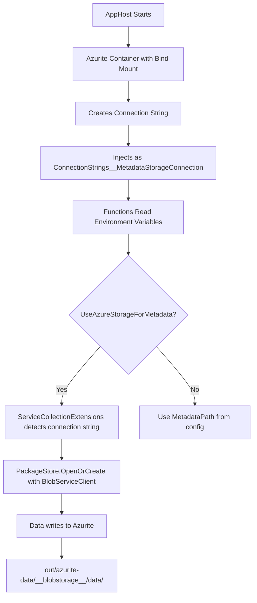

# Azure Storage Configuration Fix - Summary

## Problem
Data was being written to local file system (`./LocalContentStore`) instead of Azure Blob Storage (Azurite) when running through Aspire AppHost.

## Root Causes

### 1. Configuration Priority Issue
`local.settings.json` had hardcoded storage paths that overrode Aspire's environment variables:

```json
// ? WRONG - Was in local.settings.json
{
  "UpdateEngine": {
    "StorageConfiguration": {
      "MetadataPath": "./LocalMetadataStore",
      "ContentPath": "./LocalContentStore"
    }
  }
}
```

### 2. Environment Variable Pollution
`ConfigurationHelper.ConfigureUpdateFunctions()` was injecting `MetadataPath` and `ContentPath` environment variables even when using Azure Storage, causing confusion in the configuration hierarchy.

## Solutions Applied

### Fix 1: Clean `local.settings.json`
**File:** `UpdateEngine.Functions/src/local.settings.json`

Removed the entire `UpdateEngine` configuration section, leaving only minimal Azure Functions settings:

```json
// ? CORRECT - Minimal local.settings.json
{
  "IsEncrypted": false,
  "Values": {
    "FUNCTIONS_WORKER_RUNTIME": "dotnet-isolated",
    "AzureWebJobsSecretStorageType": "files",
    "AzureWebJobsStorage": ""
  }
}
```

**Why:** Aspire environment variables (`ConnectionStrings__MetadataStorageConnection`) now take precedence.

### Fix 2: Conditional Environment Variables
**File:** `UpdateEngine.AppHost/src/ConfigurationHelper.cs`

Modified `ConfigureUpdateFunctions()` to **not inject** local path environment variables when using Azure Storage:

```csharp
// ? CORRECT - Only set local paths when NOT using Azure Storage
if (!appConfig.StorageConfiguration.UseAzureStorageForMetadata)
{
    functions.WithEnvironment("MetadataPath", appConfig.StorageConfiguration.MetadataPath);
}

if (!appConfig.StorageConfiguration.UseAzureStorageForContent)
{
    functions.WithEnvironment("ContentPath", appConfig.StorageConfiguration.ContentPath);
}
```

**Why:** Prevents environment variable pollution that overrides Aspire connection strings.

### Fix 3: Persistent Azurite Storage
**File:** `UpdateEngine.AppHost/src/Program.cs`

Changed from anonymous volume to bind mount for data persistence:

```csharp
// ? CORRECT - Bind mount with persistence
var storage = builder.AddAzureStorage("Storage").RunAsEmulator(emulator =>
{
    emulator.WithDataBindMount("out/azurite-data");
});
```

**Why:**
- ? Data persists across container restarts
- ? Blob files visible in `out/azurite-data/` directory
- ? Easy inspection and debugging
- ? No need to re-sync 4862 packages every time
- ? Organized with other build outputs

### Fix 4: Update `.gitignore`
**File:** `.gitignore`

Already covered by existing pattern:

```gitignore
# Development - Ignore local data directories
out/
```

**Why:** The `out/` pattern already covers `out/azurite-data/`, keeping the repository clean.

## Configuration Flow After Fixes



## Verification Steps

1. **Restart AppHost:**
   ```powershell
   cd UpdateEngine.AppHost/src
   dotnet run
   ```

2. **Check Functions Startup Logs:**
   ```
   === UpdateEngine Configuration ===
   UseAzureStorageForMetadata: True
   UseAzureStorageForContent: True
   MetadataContainerName: data
   ContentContainerName: data
   ```

3. **Check ServiceCollectionExtensions Logs:**
   ```
   Metadata Store Configuration:
     UseAzureStorageForMetadata: True
     Connection String from Aspire: True
     Connection String from Config: False
   Opening Azure Blob Storage metadata store (container: data)
   ```

4. **Verify Aspire Dashboard Environment Variables:**
   - **Should exist:** `ConnectionStrings__MetadataStorageConnection`
   - **Should NOT exist:** `MetadataPath` (when using Azure Storage)

5. **Check File System:**
   ```powershell
   # Should see Azurite data
   ls out/azurite-data/__blobstorage__/data/
   
   # Should NOT see these
   ls ./LocalMetadataStore  # Should not exist
   ls ./LocalContentStore   # Should not exist
   ```

6. **Verify Blob Files:**
   ```powershell
   # After sync, check for blob files
   ls out/azurite-data/__blobstorage__/data/
   # Should see GUID-named files (metadata blobs)
   
   ls out/azurite-data/__blobstorage__/data/content/
   # Should see content blobs
   ```

## Benefits

### Before Fixes
- ? Data written to `./LocalContentStore`
- ? Aspire connection strings ignored
- ? No data persistence
- ? Re-sync needed after every restart
- ? Configuration confusion

### After Fixes
- ? Data written to Azurite (`out/azurite-data/`)
- ? Aspire connection strings respected
- ? **Data persists across restarts**
- ? No re-sync needed
- ? Clean configuration hierarchy
- ? Can inspect blob files directly
- ? Organized with build outputs

## Storage Backend Selection Logic

The fixed configuration now correctly selects storage backend:

```csharp
// In ServiceCollectionExtensions.cs
var connectionString = configuration.GetConnectionString("MetadataStorageConnection") 
    ?? storageConfig.AzureStorageConnectionString;

var useAzureStorage = (storageConfig.UseAzureStorageForMetadata && !string.IsNullOrEmpty(connectionString))
    || (!string.IsNullOrEmpty(connectionString));

if (useAzureStorage)
{
    // ? Uses Azurite via connection string from Aspire
    var blobServiceClient = new BlobServiceClient(connectionString);
    return PackageStore.OpenOrCreate(blobServiceClient, "data");
}
else
{
    // Only used when explicitly configured for local storage
    return PackageStore.OpenOrCreate(storageConfig.MetadataPath);
}
```

## Testing the Fix

### Test 1: Verify Azurite Usage
```powershell
# 1. Start AppHost
cd UpdateEngine.AppHost/src
dotnet run

# 2. Check Aspire Dashboard (http://localhost:15xxx)
#    - Resources ? UpdateEngine ? Environment
#    - Should see: ConnectionStrings__MetadataStorageConnection
#    - Should NOT see: MetadataPath or ContentPath

# 3. Check Functions logs
#    - Should see: "Opening Azure Blob Storage metadata store"
#    - Should NOT see: "Opening local file system metadata store"
```

### Test 2: Verify Data Persistence
```powershell
# 1. Run sync, wait for completion
# 2. Check Azurite directory
ls out/azurite-data/__blobstorage__/data/

# 3. Stop AppHost (Ctrl+C)
# 4. Restart AppHost
cd UpdateEngine.AppHost/src
dotnet run

# 5. Check logs - should NOT see categories sync
#    (Because store is not empty)

# 6. Verify blob files still exist
ls out/azurite-data/__blobstorage__/data/
```

### Test 3: Verify Clean Slate
```powershell
# 1. Stop AppHost
# 2. Delete Azurite data
Remove-Item -Recurse -Force out/azurite-data

# 3. Restart AppHost
cd UpdateEngine.AppHost/src
dotnet run

# 4. Should see categories sync (empty store detection)
# 5. Check new blob files created
ls out/azurite-data/__blobstorage__/data/
```

## Troubleshooting

### Still Using Local Storage?

**Check 1:** Environment variables in Aspire dashboard
```
Resources ? UpdateEngine ? Environment
? Should have: ConnectionStrings__MetadataStorageConnection
? Should NOT have: MetadataPath (when UseAzureStorageForMetadata=true)
```

**Check 2:** Configuration hierarchy
```csharp
// In Program.cs, check logs:
UseAzureStorageForMetadata: True  // ? Should be True
MetadataContainerName: data       // ? Should see this
```

**Check 3:** ServiceCollectionExtensions logs
```
Connection String from Aspire: True   // ? Must be True
Opening Azure Blob Storage metadata store  // ? Must see this
```

### Data Not Persisting?

**Check:** Azurite bind mount configuration
```csharp
// In UpdateEngine.AppHost/src/Program.cs
emulator.WithDataBindMount("out/azurite-data");  // ? Should see this
```

**Verify:** Directory exists after restart
```powershell
ls out/azurite-data/__blobstorage__/
```

### Cannot See Blob Files?

**Check:** Using bind mount (not named volume)
```csharp
// ? CORRECT
emulator.WithDataBindMount("out/azurite-data");

// ? WRONG - Can't see files
emulator.WithDataVolume("aspire-azurite-data");
```

## Files Modified

1. ? `UpdateEngine.Functions/src/local.settings.json` - Removed storage paths
2. ? `UpdateEngine.AppHost/src/ConfigurationHelper.cs` - Conditional env vars
3. ? `UpdateEngine.AppHost/src/Program.cs` - Bind mount with persistence
4. ? `.gitignore` - Already covered by `out/` pattern

## Documentation Created

1. ? `docs/guides/AZURITE_STORAGE_OPTIONS.md` - Storage configuration guide
2. ? This summary document

## Related Issues Fixed

- **Phase 1-6:** Various startup and runtime issues
- **Phase 7:** Store corruption detection
- **Phase 8:** Azure Storage integration ? **This fix**

## Next Steps

1. Test the complete fix
2. Verify data writes to Azurite
3. Confirm data persists across restarts
4. Use Azure Storage Explorer to inspect blobs (optional)

## Reference

- **Aspire Docs:** https://learn.microsoft.com/en-us/dotnet/aspire/storage/azure-storage-emulator
- **Azurite GitHub:** https://github.com/Azure/Azurite
- **Storage Options Guide:** `docs/guides/AZURITE_STORAGE_OPTIONS.md`
