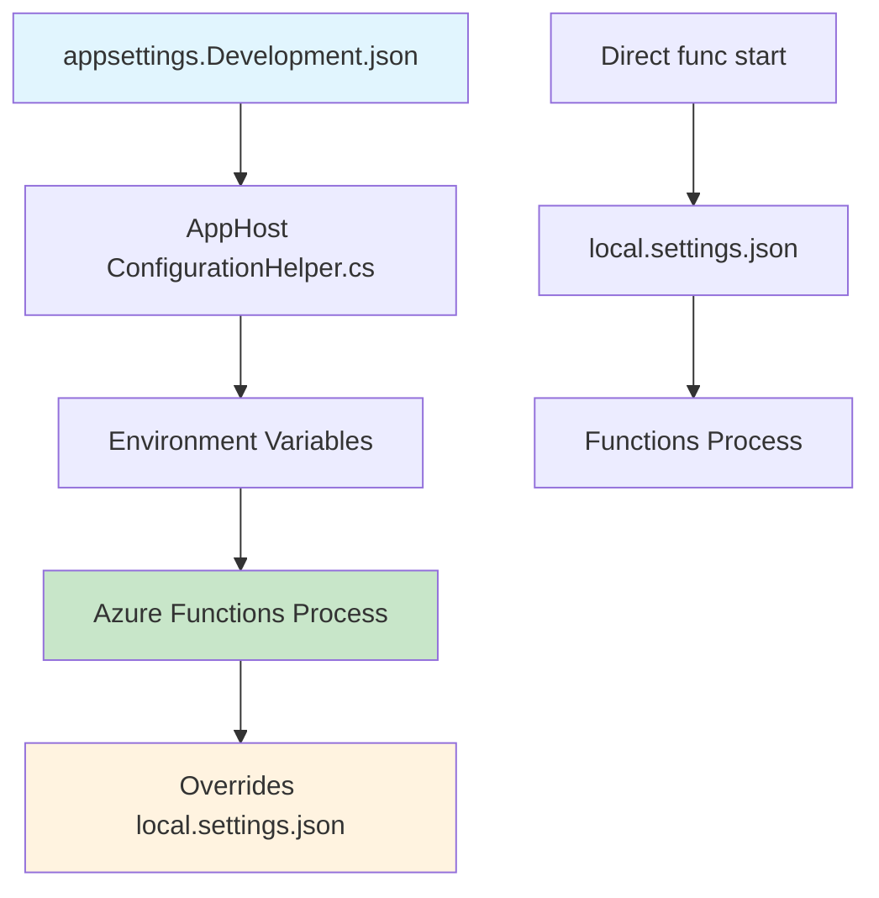

# Configuration Override System

This document explains how configuration works when using the AppHost vs running Azure Functions directly, including the priority system and override behavior.

## Configuration Priority Hierarchy

When using the Microsoft Update Server-Server Sync application, configuration is loaded in the following priority order (highest to lowest):

### 🏆 **1. AppHost Environment Variables** (Highest Priority)
- **Source**: `UpdateEngine.AppHost/src/ConfigurationHelper.cs`
- **When Active**: Running via `cd UpdateEngine.AppHost && dotnet run`
- **Mechanism**: Injected as environment variables into Azure Functions process
- **Overrides**: All lower priority configurations

### 🥈 **2. AppHost Configuration Files** 
- **Source**: `UpdateEngine.AppHost/src/appsettings.{Environment}.json`
- **Environments**: 
  - `appsettings.Development.json` (Development)
  - `appsettings.IntegrationTest.json` (Integration Testing)
  - `appsettings.Production.json` (Production)
- **Base**: `appsettings.json` (Default settings)

### 🥉 **3. Azure Functions Local Settings**
- **Source**: `UpdateEngine.Functions/src/local.settings.json`
- **When Active**: Running Functions directly via `func start`
- **Scope**: Local development only

### 📄 **4. Base Configuration**
- **Source**: `UpdateEngine.AppHost/src/appsettings.json`
- **Purpose**: Default fallback values

## Configuration Flow Diagram



## Environment-Specific Schedules

### **Development Environment** (`appsettings.Development.json`)
**Purpose**: Rapid testing with Aspire & Azurite storage emulator

| Function | Schedule | Frequency | Purpose |
|----------|----------|-----------|---------|
| **Critical Metadata Sync** | `00:02:00` | Every 2 minutes | Quick security update testing |
| **Content Sync** | `00:03:00` | Every 3 minutes | Rapid content download validation |
| **Comprehensive Metadata** | `00:05:00` | Every 5 minutes | Full metadata sync testing |
| **Anomaly Detection** | `00:02:00` | Every 2 minutes | ML.NET pattern analysis testing |
| **Health Monitoring** | `00:01:00` | Every 1 minute | System health validation |

**Additional Development Settings**:
- `MaxUpdateCount`: 5 (vs 1000 production)
- `SupportedCategories`: ["Security Updates", "Critical Updates"]
- Enhanced debug logging for anomaly detection
- Azurite storage emulator integration

### **Production Environment** (`appsettings.json`)
**Purpose**: Production-ready scheduling for operational deployments

| Function | Schedule | Frequency | Purpose |
|----------|----------|-----------|---------|
| **Critical Metadata Sync** | `02:00:00` | Every 2 hours | Security update distribution |
| **Content Sync** | `3.00:00:00` | Every 3 days | Content availability management |
| **Comprehensive Metadata** | `1.00:00:00` | Every 24 hours | Complete catalog synchronization |
| **Anomaly Detection** | `00:30:00` | Every 30 minutes | Production monitoring |
| **Health Monitoring** | `00:15:00` | Every 15 minutes | System reliability checks |

### **Local Functions** (`local.settings.json`)
**Purpose**: Direct Azure Functions development (bypassing AppHost)

Uses production schedules when running `func start` directly:
- Critical Sync: `02:00:00` 
- Content Sync: `3.00:00:00`
- Anomaly Detection: `00:30:00`

## Configuration Override Mechanism

### **AppHost Configuration Injection**

The `ConfigurationHelper.cs` class automatically injects AppHost settings as environment variables:

```csharp
// From UpdateEngine.AppHost/src/ConfigurationHelper.cs
functions
    .WithEnvironment("SyncMetadataCriticalSchedule", schedules.SyncMetadataCriticalSchedule)
    .WithEnvironment("SyncContentSchedule", schedules.SyncContentSchedule)
    .WithEnvironment("AnomalyDetectionSchedule", schedules.AnomalyDetectionSchedule)
    .WithEnvironment("ScheduledHealthCheckSchedule", schedules.ScheduledHealthCheckSchedule);
```

### **Timer Trigger Configuration**

Azure Functions read these environment variables for timer schedules:

```csharp
// From UpdateEngine Functions
[Function("SyncCritical")]
public async Task SyncCritical([TimerTrigger("%SyncCriticalSchedule%")] TimerInfo timer)

[Function("ScheduledAnomalyDetection")]  
public async Task RunScheduledAnomalyDetection([TimerTrigger("%AnomalyDetectionSchedule%")] TimerInfo timer)
```

### **Function Enable/Disable Control**

AppHost also controls which functions are enabled/disabled:

```csharp
// From ConfigurationHelper.cs
foreach (var job in azureWebJobsConfig.GetChildren())
{
    var disabledValue = job.GetValue<bool>("Disabled");
    functions.WithEnvironment($"AzureWebJobs.{job.Key}.Disabled", disabledValue.ToString().ToLower());
}
```

## Running Scenarios

### **Scenario 1: AppHost Development** 
```powershell
cd UpdateEngine.AppHost
dotnet run --project src/AppHost.csproj
```
**Result**: 
- ✅ Uses `appsettings.Development.json` (rapid 1-5 minute schedules)
- ✅ Azurite storage emulator auto-configured
- ✅ All development optimizations active

### **Scenario 2: Direct Functions Development**
```powershell
cd UpdateEngine.Functions/src  
func start
```
**Result**:
- ✅ Uses `local.settings.json` (production 2+ hour schedules)
- ⚠️ Manual storage configuration required
- ⚠️ No Aspire orchestration

### **Scenario 3: Integration Testing**
```powershell
cd UpdateEngine.AppHost
dotnet run --environment IntegrationTest
```
**Result**:
- ✅ Uses `appsettings.IntegrationTest.json`
- ✅ Test-optimized schedules and limits
- ✅ Automated test infrastructure

## Configuration Files Reference

### **Core Configuration Locations**

| File | Purpose | Environment | Override Level |
|------|---------|-------------|----------------|
| `UpdateEngine.AppHost/src/appsettings.json` | Base configuration | All | Lowest |
| `UpdateEngine.AppHost/src/appsettings.Development.json` | Rapid testing | Development | Highest |
| `UpdateEngine.AppHost/src/appsettings.IntegrationTest.json` | Automated testing | CI/CD | Highest |
| `UpdateEngine.AppHost/src/appsettings.Production.json` | Production deployment | Production | Highest |
| `UpdateEngine.Functions/src/local.settings.json` | Direct Functions | Local dev | Medium |

### **Configuration Sections**

#### **FunctionSchedules**
Timer trigger schedules in TimeSpan format:
```json
{
  "FunctionSchedules": {
    "SyncMetadataCriticalSchedule": "00:02:00",
    "SyncContentSchedule": "00:03:00", 
    "AnomalyDetectionSchedule": "00:02:00",
    "ScheduledHealthCheckSchedule": "00:01:00"
  }
}
```

#### **AzureWebJobs** 
Function enable/disable control:
```json
{
  "AzureWebJobs": {
    "ScheduledAnomalyDetection": { "Disabled": false },
    "SyncCritical": { "Disabled": false },
    "TrainAnomalyModel": { "Disabled": true }
  }
}
```

#### **Storage**
Storage backend configuration:
```json
{
  "Storage": {
    "UseAzureStorageForMetadata": true,
    "UseAzureStorageForContent": true,
    "MetadataContainerName": "data",
    "ContentContainerName": "data"
  }
}
```

#### **Service**
Application limits and URLs:
```json
{
  "Service": {
    "MaxUpdateCount": 5,
    "ServiceUrl": "http://localhost:7071",
    "SupportedCategories": ["Security Updates", "Critical Updates"]
  }
}
```

## Troubleshooting Configuration Issues

### **Functions Not Using Expected Schedule**

**Problem**: Functions using wrong timer intervals  
**Solution**: 
1. Verify running via AppHost: `cd UpdateEngine.AppHost && dotnet run`
2. Check `appsettings.Development.json` for correct schedules
3. Confirm `ConfigurationHelper.cs` maps the schedule property

### **Configuration Not Taking Effect**

**Problem**: Changes to appsettings not applied  
**Solution**:
1. Restart AppHost: `Ctrl+C` then `dotnet run` 
2. Verify environment: `ASPNETCORE_ENVIRONMENT=Development`
3. Check for JSON syntax errors in configuration files

### **Timer Triggers Not Firing**

**Problem**: Scheduled functions never execute  
**Solution**:
1. Ensure function not disabled in `AzureWebJobs` section
2. Verify schedule format: `HH:mm:ss` or `d.HH:mm:ss`
3. Check Azure Functions logs for trigger registration

### **Storage Configuration Conflicts**

**Problem**: Functions using wrong storage backend  
**Solution**:
1. Verify `UseAzureStorageForMetadata/Content: true` in AppHost settings
2. Confirm Azurite container started via Aspire
3. Check environment variable injection in `ConfigurationHelper.cs`

## Best Practices

### **Development Workflow**
1. **Use AppHost for local development** - automatic configuration override
2. **Edit `appsettings.Development.json`** for rapid testing schedules  
3. **Restart AppHost** after configuration changes
4. **Monitor function logs** to verify schedule application

### **Configuration Management** 
1. **Environment-specific settings** in dedicated appsettings files
2. **Base settings** in `appsettings.json` for defaults
3. **Sensitive data** via environment variables or Azure Key Vault
4. **Schedule validation** using TimeSpan parsing with fallbacks

### **Testing Strategy**
1. **Development**: 1-5 minute schedules for rapid feedback
2. **Integration**: Moderate schedules for automated testing  
3. **Production**: Hour/day schedules for operational efficiency
4. **Function isolation** via enable/disable flags per environment

---

## Quick Reference

**Start with rapid testing**: `cd UpdateEngine.AppHost && dotnet run`  
**Check configuration priority**: AppHost > appsettings.{Environment}.json > local.settings.json  
**Verify schedules**: Function logs show "Next run: {time}" after trigger execution  
**Debug configuration**: Review environment variables injected by `ConfigurationHelper.cs`
