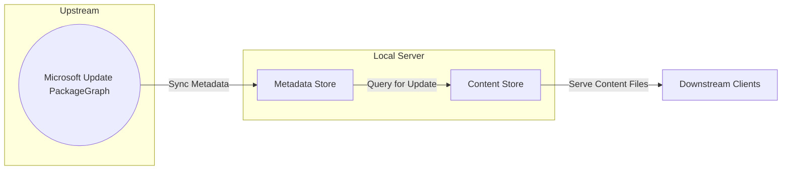
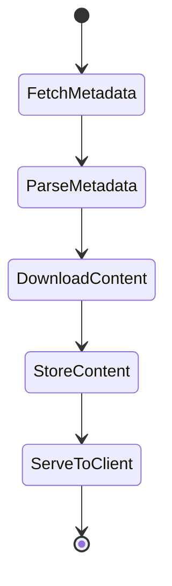
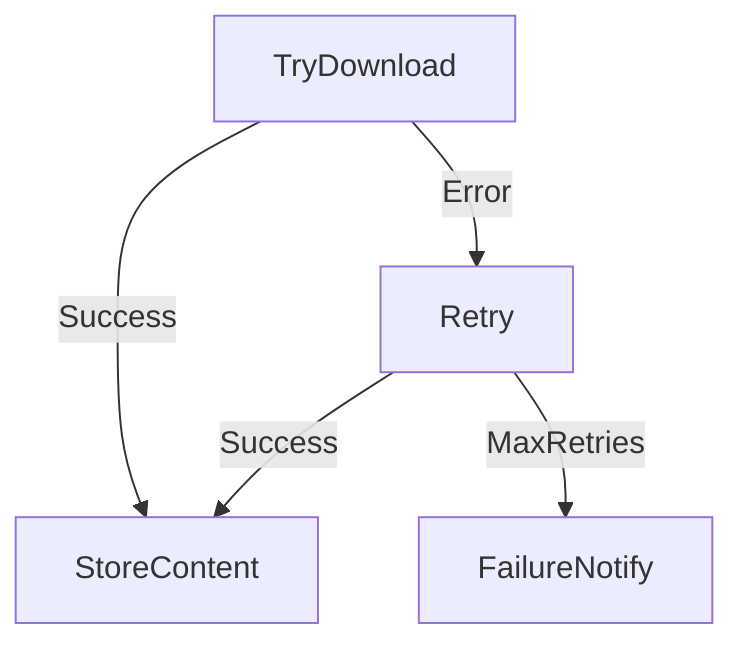
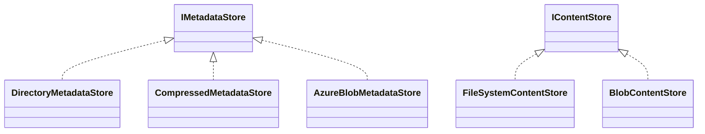
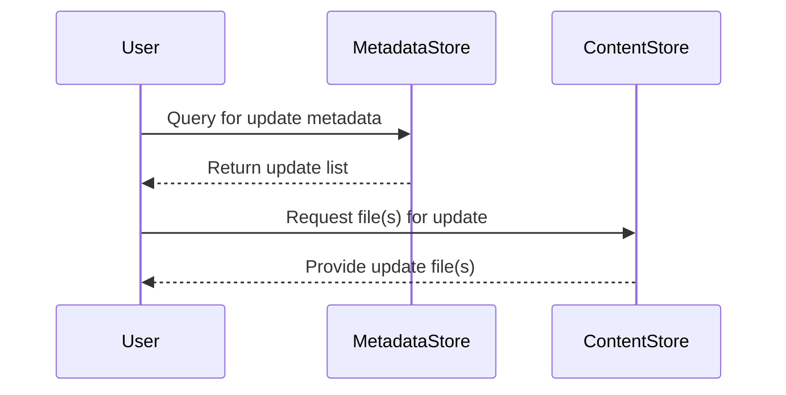
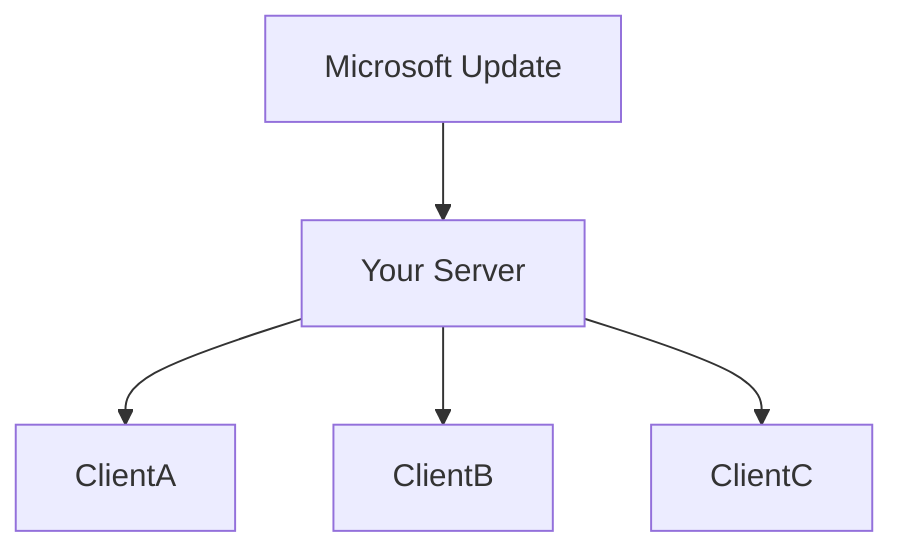
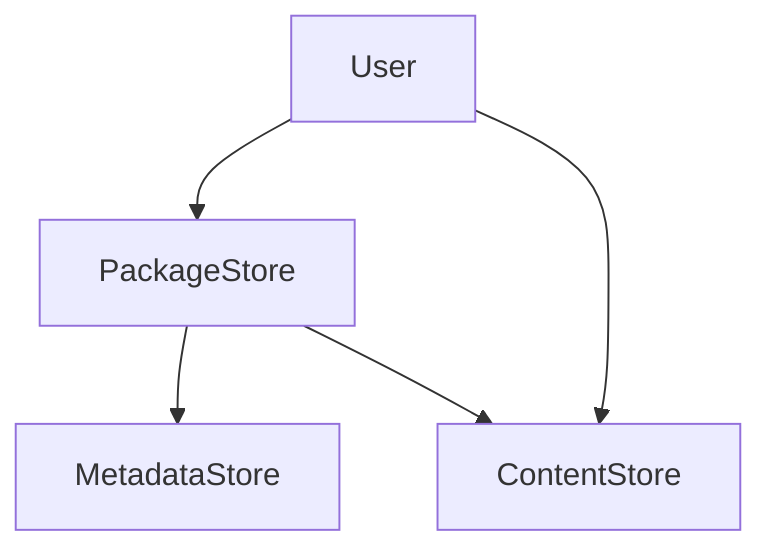
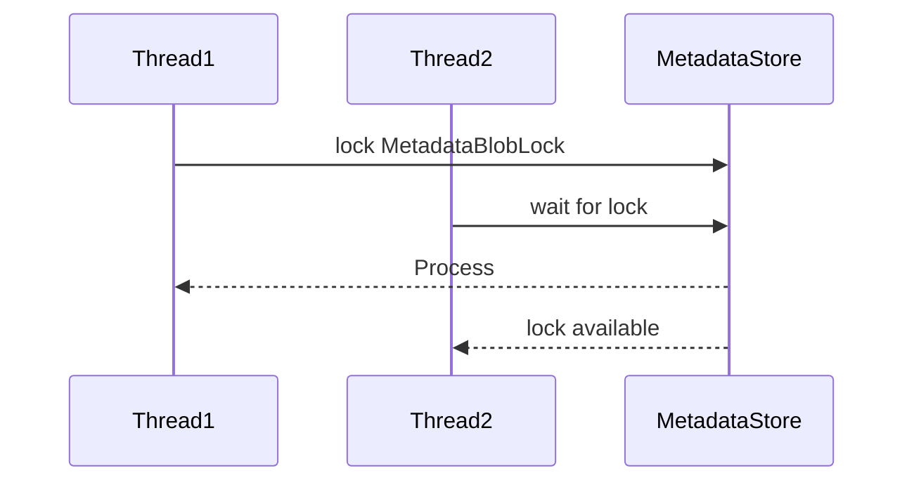
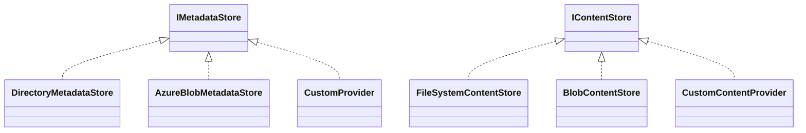
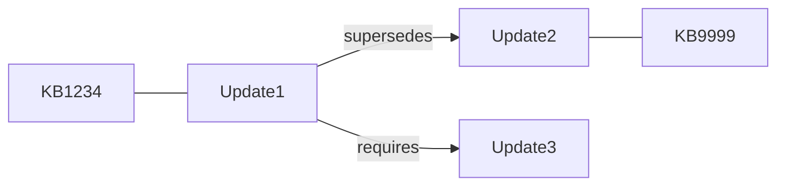

# Update Server - Server Sync

This repository provides tools for synchronizing Microsoft Update catalogs, combining **metadata stores** and **content stores** to manage update metadata and actual content files.

---

## Overview

- **Metadata Store:** Keeps track of update information, descriptions, relationships, rules, KB articles, and other properties. Indexing and query is highly optimized.
- **Content Store:** Manages the actual payload files referenced by updates—such as patch binaries or cabinet files.

---

## Core Visual Architecture

### High-Level Data Flow



---

## 1. Lifecycle Diagram


*Shows the stages an update passes through: fetching metadata, parsing, downloading content, storing, serving.*

---

## 2. Error Handling and Retry Flow


*Visualizes the retry/failure approach taken by content store operations.*

---

## 3. Component Diagram


*Outlines interface inheritance and extensibility for metadata/content stores.*

---

## 4. Sequence Diagram


*Illustrates update fetch and content download operation.*

---

## 5. Storage Layout Examples

#### Metadata Store

```
store/
└── metadata/
    └── partitions/
        └── [partition]/
            └── [index]/
                └── [updateId].xml
```

#### Content Store

```
content/
└── [updateId]/
    └── [actual file]
```
*Clarifies on-disk structure for local storage.*

---

## 6. Synchronization Scenario Diagram


*Demonstrates typical multi-client sync architecture.*

---

## 7. API Usage Diagram


*Shows API entry points and key classes.*

---

## 8. Concurrency Diagram


*Visualizes thread safety and locking for concurrent operations.*

---

## 9. Extensibility Layer


*Illustrates how to add custom storage providers.*

---

## 10. Update Object Model Relationships


*Shows how updates relate through metadata—supersedence, KB, requirements.*

---

## Decision Table

| Use Case                | Metadata Store Backend      | Content Store Backend   | Pros                  | Cons                      |
|-------------------------|----------------------------|------------------------|-----------------------|---------------------------|
| Small/local deployment  | DirectoryMetadataStore     | FileSystemContentStore | Easy, fast filesystem | Not cloud-scalable        |
| Cloud/distributed       | AzureBlobMetadataStore     | BlobContentStore       | Cloud-based, scalable | Needs setup, network cost |
| Compressed archive      | CompressedMetadataStore    | FileSystemContentStore | One file, portable    | Slower queries            |

---

## Further Reading

- [IMetadataStore API documentation](https://github.com/Sntai20/update-server-server-sync/blob/main/docs/api/Microsoft.PackageGraph.Storage.IMetadataStore.html)
- [IContentStore API documentation](https://github.com/Sntai20/update-server-server-sync/blob/main/docs/api/Microsoft.PackageGraph.Storage.IContentStore.html)
- [Example: fetching and storing content](https://github.com/Sntai20/update-server-server-sync/blob/main/src/documentation/docfx-config/examples/content-store.md)
- Source files:
  - [MetadataStore (Azure)](https://github.com/Sntai20/update-server-server-sync/blob/main/src/microsoft-update-partition/Storage/AzureBlob/MetadataStore.cs)
  - [DirectoryMetadataStore (Filesystem)](https://github.com/Sntai20/update-server-server-sync/blob/main/src/microsoft-update-partition/Storage/FileSystem/DirectoryMetadataStore.cs)
  - [FileSystemContentStore](https://github.com/Sntai20/update-server-server-sync/blob/main/src/microsoft-update-partition/Storage/FileSystem/FileSystemContentStore.cs)
  - [BlobContentStore (Azure)](https://github.com/Sntai20/update-server-server-sync/blob/main/src/microsoft-update-partition/Storage/AzureBlob/BlobContentStore.cs)

---

## License

MIT
