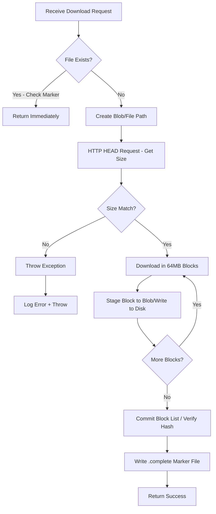

# Content Storage Architecture
**Windows Update Content File Storage Documentation**

## Table of Contents
1. [Overview](#overview)
2. [Storage Implementations](#storage-implementations)
3. [Content-Addressed Storage Model](#content-addressed-storage-model)
4. [File Naming and Organization](#file-naming-and-organization)
5. [Download and Verification Process](#download-and-verification-process)
6. [Azure Blob Storage Implementation](#azure-blob-storage-implementation)
7. [File System Storage Implementation](#file-system-storage-implementation)
8. [Marker Files and Deduplication](#marker-files-and-deduplication)
9. [File Types and Content](#file-types-and-content)
10. [Local Development with Azurite](#local-development-with-azurite)
11. [Performance Characteristics](#performance-characteristics)
12. [Troubleshooting](#troubleshooting)

---

## Overview

The UpdateEngine system stores Windows Update content files (the actual binary updates) using a **content-addressed storage** approach. Files are stored by their cryptographic hash rather than by their original filename, enabling automatic deduplication and integrity verification.

### Key Characteristics

- **Content-Addressed**: Files stored by SHA-1 or SHA-256 hash
- **No File Extensions**: Content files have no extensions (e.g., `3fa2b8c1a0d5e7f9...`)
- **Deduplication**: Same content stored only once, regardless of filename
- **Marker-Based Completion**: `.complete` marker files prevent re-downloads
- **Multiple Implementations**: Azure Blob Storage and local file system
- **Block-Based Downloads**: Large files downloaded in 64MB chunks for resumability

---

## Storage Implementations

The system provides two `IContentStore` implementations:

| Implementation | Use Case | Storage Location | Production Ready |
|----------------|----------|------------------|------------------|
| **BlobContentStore** | Azure Functions, scalable deployments | Azure Blob Storage (or Azurite emulator) | ? Yes |
| **FileSystemContentStore** | WorkerService, local development, CLI tools | Local file system | ? Yes |

### Implementation Selection

Configuration in `appsettings.json`:

```json
{
  "UpdateEngine": {
    "StorageConfiguration": {
      "UseAzureStorageForContent": true,  // true = BlobContentStore, false = FileSystemContentStore
      "ContentContainerName": "data"
    }
  }
}
```

---

## Content-Addressed Storage Model

### What is Content-Addressed Storage?

Instead of storing files by name (e.g., `windows10-kb5001234-x64.cab`), the system stores them by their **cryptographic hash** (e.g., `3fa2b8c1a0d5e7f9...`). This approach provides:

1. **Automatic Deduplication**: Two updates with the same file ? stored once
2. **Integrity Verification**: Hash = filename, so corruption is detectable
3. **Source-Agnostic**: Multiple sources can provide the same content
4. **Efficient Storage**: No duplicate content across update history

### Hash Algorithms Supported

Updates typically provide multiple hash algorithms:

- **SHA-1** (legacy, primary): 40-character hex string
- **SHA-256** (modern): 64-character hex string
- **SHA-384/SHA-512** (rare): Longer hashes for critical updates

The system uses the **first digest** (typically SHA-1) as the primary storage key.

### Example

**Update Metadata:**
```json
{
  "FileName": "Windows10.0-KB5001234-x64.cab",
  "Size": 524288000,
  "Digests": [
    {
      "Algorithm": "SHA1",
      "DigestBase64": "P6K4waDF5/k=",
      "HexString": "3fa2b8c1a0d5e7f9abc123def456789012345678"
    }
  ]
}
```

**Storage Path (Blob):**
```
data/content/3fa2b8c1a0d5e7f9abc123def456789012345678
data/content/3fa2b8c1a0d5e7f9abc123def456789012345678.complete
```

**Storage Path (FileSystem):**
```
content/8/3fa2b8c1a0d5e7f9abc123def456789012345678/3fa2b8c1a0d5e7f9abc123def456789012345678
content/8/3fa2b8c1a0d5e7f9abc123def456789012345678/3fa2b8c1a0d5e7f9abc123def456789012345678.done
```

---

## File Naming and Organization

### Azure Blob Storage (BlobContentStore)

**Flat structure with optional path prefix:**

```
ContainerName: "data"
PathPrefix: "content"

Blob Paths:
  data/content/3fa2b8c1a0d5e7f9abc123def456789012345678            ? Content file
  data/content/3fa2b8c1a0d5e7f9abc123def456789012345678.complete  ? Marker file
  data/content/7b4d9e2f1a8c5e0d9f8a7b6c5d4e3f2a1b0c9d8e            ? Another content file
  data/content/7b4d9e2f1a8c5e0d9f8a7b6c5d4e3f2a1b0c9d8e.complete  ? Its marker
```

**Characteristics:**
- **No subdirectories** in blob path (flat structure)
- **Case-insensitive** (hashes stored in lowercase)
- **Path prefix** configurable (default: `content`)
- **Marker files** stored alongside content files

### File System Storage (FileSystemContentStore)

**Hierarchical structure with hash-based subdirectories:**

```
RootPath: "./store"
ContentDirectory: "content"

File Paths:
  content/
    ??? 0/
    ?   ??? 0a1b2c3d... (hash starting with 0x0)
    ?       ??? 0a1b2c3d...
    ?       ??? 0a1b2c3d....done
    ??? 8/
    ?   ??? 3fa2b8c1... (hash starting with 0x8)
    ?       ??? 3fa2b8c1...
    ?       ??? 3fa2b8c1....done
    ??? F/
        ??? ff9e8d7c... (hash starting with 0xF)
            ??? ff9e8d7c...
            ??? ff9e8d7c....done
```

**Subdirectory Logic:**
- Directory name = **last byte** of hash (0x0 through 0xF ? 16 directories)
- Distributes files evenly across subdirectories
- Prevents "too many files in one directory" issues on file systems

**Code:**
```csharp
public static string GetContentDirectoryName(IContentFileDigest fileDigest)
{
    byte[] hashBytes = Convert.FromBase64String(fileDigest.DigestBase64);
    return string.Format("{0:X}", hashBytes.Last()); // Last byte as hex (0-F)
}
```

---

## Download and Verification Process

### Download Workflow



### Block-Based Download (BlobContentStore)

Large files are downloaded in **64MB chunks** for:
- **Resumability**: Can resume interrupted downloads
- **Memory Efficiency**: Don't load entire file into memory
- **Progress Tracking**: Report progress every 10MB

**Code (Simplified):**
```csharp
const long BlockSize = 64 * 1024 * 1024; // 64MB
var blockCount = fileSizeOnServer / BlockSize + (fileSizeOnServer % BlockSize == 0 ? 0 : 1);

for (int i = 0; i < blockCount; i++)
{
    var startOffset = i * BlockSize;
    var blockSize = (i == blockCount - 1) ? fileSizeOnServer % BlockSize : BlockSize;
    
    // Download block from Microsoft Update servers
    using var request = new HttpRequestMessage { RequestUri = new Uri(file.Source) };
    request.Headers.Range = new RangeHeaderValue(startOffset, startOffset + blockSize - 1);
    
    // Upload block to Azure Blob Storage
    var blockId = Convert.ToBase64String(BitConverter.GetBytes(i));
    fileBlob.StageBlock(blockId, downloadStream);
    
    blockIdList.Add(blockId);
}

// Commit all blocks atomically
fileBlob.CommitBlockList(blockIdList);
```

### Retry Logic

**Transient failure handling:**
- **Max Retries**: 3 attempts per block
- **Exponential Backoff**: 2s ? 4s ? 8s delays
- **Retry Metrics**: Tracks retry attempts and failure reasons
- **Exception Handling**: `HttpRequestException`, `TaskCanceledException`, `OperationCanceledException`

**Handled Scenarios:**
- Network timeouts (5-minute timeout per block)
- Temporary 503 Service Unavailable from Microsoft servers
- Connection reset errors
- Partial HTTP responses

---

## Azure Blob Storage Implementation

### BlobContentStore Class

**Key Features:**
- **SAS Token Generation**: Temporary read URLs for downloaded content
- **Concurrent Download Tracking**: `ConcurrentDictionary<string, IContentFile>`
- **Metrics Integration**: Tracks downloads, bytes, duration, retries
- **Marker-Based Completion**: `.complete` files prevent re-downloads
- **Resumable Downloads**: Can resume interrupted multi-block downloads

### Blob Naming Convention

```csharp
private BlockBlobClient GetBlobForFile(IContentFile updateFile)
{
    var blobName = string.IsNullOrEmpty(this.PathPrefix) 
        ? updateFile.Digest.HexString.ToLower()
        : $"{this.PathPrefix.TrimEnd('/')}/{updateFile.Digest.HexString.ToLower()}";
    
    return this.ParentContainer.GetBlockBlobClient(blobName);
}

private BlockBlobClient GetBlobMarkerForFile(IContentFile updateFile)
{
    var markerName = string.IsNullOrEmpty(this.PathPrefix) 
        ? updateFile.Digest.HexString.ToLower() + ".complete"
        : $"{this.PathPrefix.TrimEnd('/')}/{updateFile.Digest.HexString.ToLower()}.complete";
        
    return this.ParentContainer.GetBlockBlobClient(markerName);
}
```

### SAS Token Generation

For secure content delivery:

```csharp
public string GetUri(IContentFile updateFile)
{
    var fileBlob = this.GetBlobForFile(updateFile);
    
    var sasBuilder = new BlobSasBuilder
    {
        BlobContainerName = fileBlob.BlobContainerName,
        BlobName = fileBlob.Name,
        Resource = "b", // Blob
        StartsOn = DateTimeOffset.UtcNow.AddMinutes(-5),
        ExpiresOn = DateTimeOffset.UtcNow.AddMinutes(10), // 10-minute window
    };
    sasBuilder.SetPermissions(BlobSasPermissions.Read);
    
    return fileBlob.GenerateSasUri(sasBuilder).ToString();
}
```

---

## File System Storage Implementation

### FileSystemContentStore Class

**Key Features:**
- **Hierarchical Directory Structure**: 16 subdirectories (0-F)
- **Marker Files**: `.done` files instead of `.complete`
- **Hash Verification**: Uses `ContentHash` class to verify downloads
- **Progress Events**: Raises events for download, hashing, completion

### Directory Structure Creation

```csharp
public string GetUri(IContentFile updateFile)
{
    var contentSubDirectory = GetContentDirectoryName(updateFile.Digest); // e.g., "8"
    var hashString = updateFile.Digest.HexString; // e.g., "3fa2b8c1..."
    
    // Result: content/8/3fa2b8c1.../3fa2b8c1...
    return Path.Combine(
        ContentDirectoryPath,       // "content"
        contentSubDirectory,        // "8"
        hashString,                 // "3fa2b8c1..."
        hashString                  // "3fa2b8c1..." (filename)
    );
}
```

### Marker File Usage

**FileSystem marker example:**
```
content/8/3fa2b8c1a0d5e7f9abc123def456789012345678/
  ??? 3fa2b8c1a0d5e7f9abc123def456789012345678      ? Binary content
  ??? 3fa2b8c1a0d5e7f9abc123def456789012345678.done ? Contains original filename
```

**Marker file content:**
```
Windows10.0-KB5001234-x64.cab
```

This preserves the original filename for reference while using hash-based storage.

---

## Marker Files and Deduplication

### Purpose of Marker Files

Marker files serve multiple critical functions:

1. **Completion Indicator**: Marks that download AND verification succeeded
2. **Atomic Operation**: Written only after successful hash verification
3. **Re-download Prevention**: Checked before starting downloads
4. **Metadata Preservation**: (FileSystem only) Stores original filename
5. **Failure Recovery**: Missing marker = incomplete download, retry needed

### Marker File Formats

**Azure Blob Storage:**
- **Name**: `{hash}.complete`
- **Content**: Base64-encoded hash (for verification)
- **Size**: Small (typically < 100 bytes)

**File System:**
- **Name**: `{hash}.done`
- **Content**: Original filename (text)
- **Size**: Length of filename string

### Deduplication Example

**Scenario:** Two updates share the same file (common for cumulative updates)

```
Update KB5001234:
  - File: Windows10.0-KB5001234-x64.cab
  - Hash: 3fa2b8c1...

Update KB5001235 (cumulative):
  - File: Windows10.0-KB5001235-x64.cab (different name)
  - Hash: 3fa2b8c1... (same hash)
```

**Storage Result:**
```
Only ONE file stored:
  data/content/3fa2b8c1...
  data/content/3fa2b8c1....complete

Both updates reference the same content.
Storage saved: ~500MB (typical update size)
```

---

## File Types and Content

### Binary File Types Stored

The content store handles various Windows Update binary formats:

| File Type | Extension | Description | Typical Size |
|-----------|-----------|-------------|--------------|
| **Cabinet Files** | `.cab` | Compressed update archives | 10MB - 2GB |
| **MSI Installers** | `.msi` | Windows Installer packages | 5MB - 500MB |
| **Executables** | `.exe` | Self-extracting updates | 1MB - 100MB |
| **PSF Files** | `.psf` | Windows Update metadata | 1KB - 10KB |
| **Manifest Files** | `.manifest` | Component manifests | 1KB - 50KB |
| **Driver Packages** | `.inf` | Driver information files | 1KB - 100KB |
| **Delta Patches** | Various | Binary delta patches | 10MB - 1GB |

**Important:** Files are stored **WITHOUT extensions** in the content store. The original filename (with extension) is preserved only in:
1. Update metadata (`UpdateFile.FileName`)
2. FileSystem marker files (`.done` content)

### Content Examples

**Example 1: Security Update CAB**
```
Original Name: Windows10.0-KB5034441-x64.cab
Size: 523,876,352 bytes (499.6 MB)
Hash: 7b3a8f2c1e9d5a0b4f8c7e6d5a4b3c2d1e0f9a8b
Storage Path: data/content/7b3a8f2c1e9d5a0b4f8c7e6d5a4b3c2d1e0f9a8b
```

**Example 2: Driver Update**
```
Original Name: nvdisplay.container.arm64_10.24.0.0_9876543210abcdef.cab
Size: 45,123,456 bytes (43.0 MB)
Hash: f9e8d7c6b5a4930211fedcba98765432
Storage Path: data/content/f9e8d7c6b5a4930211fedcba98765432
```

**Example 3: Definition Update (Small)**
```
Original Name: mpas-fe.exe
Size: 1,234,567 bytes (1.2 MB)
Hash: 0a1b2c3d4e5f6a7b8c9d0e1f2a3b4c5d6e7f8a9b
Storage Path: data/content/0a1b2c3d4e5f6a7b8c9d0e1f2a3b4c5d6e7f8a9b
```

---

## Local Development with Azurite

### Azurite Storage Emulator

For local development, the system uses **Azurite** to emulate Azure Blob Storage:

**Azurite Directory Structure:**
```
UpdateEngine.AppHost\src\out\azurite-data\
  ??? __azurite_db_blob__.json          ? Blob metadata database
  ??? __azurite_db_queue__.json         ? Queue metadata database
  ??? __azurite_db_table__.json         ? Table metadata database
  ??? AzuriteConfig                      ? Configuration
  ??? __blobstorage__/                   ? Actual blob data
      ??? 0xxx.../                       ? Blobs starting with 0
      ??? 1xxx.../                       ? Blobs starting with 1
      ??? 3xxx.../
      ??? 7xxx.../
      ??? ...
```

### Azurite File Organization

**Azurite organizes blobs by hash prefix (first characters):**

```
__blobstorage__/
  ??? 0a1b2c3d.../                       ? Hash: 0a1b2c3d...
  ?   ??? content_blob_data              ? Binary content
  ??? 3fa2b8c1.../                       ? Hash: 3fa2b8c1...
  ?   ??? content_blob_data
  ??? 7b4d9e2f.../
      ??? content_blob_data
```

**Finding your content files:**
```powershell
# List all content blobs in Azurite
Get-ChildItem -Path "C:\Users\{USER}\Repos\update-server-server-sync\UpdateEngine.AppHost\src\out\azurite-data\__blobstorage__" -Recurse -File
```

### Azurite vs. Azure Storage

| Feature | Azurite (Development) | Azure Storage (Production) |
|---------|----------------------|---------------------------|
| **Performance** | Fast (local disk) | Variable (network latency) |
| **Persistence** | Local files | Durable, geo-replicated |
| **Cost** | Free | Pay-per-GB + operations |
| **Scalability** | Limited to disk size | Petabyte-scale |
| **SAS Tokens** | Emulated | Full support |
| **Access Control** | None (local only) | RBAC, Entra ID |

**Configuration:**
```json
{
  "ConnectionStrings": {
    "BlobStorageConnection": "UseDevelopmentStorage=true"  // Uses Azurite
  }
}
```

---

## Performance Characteristics

### BlobContentStore Performance

| Operation | Latency (Local/Azurite) | Latency (Azure) | Throughput |
|-----------|------------------------|-----------------|------------|
| **Check if file exists** | < 1ms | 10-50ms | 1000+ ops/sec |
| **Download single block** | 50-200ms | 200-1000ms | ~500 MB/s (local) |
| **Stage block to blob** | 10-50ms | 100-500ms | ~200 MB/s |
| **Commit block list** | 50-100ms | 200-1000ms | N/A |
| **Generate SAS token** | < 1ms | < 1ms | 10,000+ ops/sec |

### FileSystemContentStore Performance

| Operation | Latency | Throughput |
|-----------|---------|------------|
| **Check if file exists** | < 1ms | 10,000+ ops/sec |
| **Download to disk** | Variable | ~300 MB/s (SSD), ~100 MB/s (HDD) |
| **Hash verification** | 500ms - 5s | ~100-200 MB/s |
| **Write marker file** | < 1ms | 1000+ ops/sec |

### Scalability Limits

**Azure Blob Storage:**
- **Max blob size**: 4.75 TB per blob
- **Max container size**: Unlimited (petabyte-scale)
- **Concurrent downloads**: 500+ parallel operations
- **Max throughput**: 60 Gbps per storage account

**File System:**
- **Max file size**: OS-dependent (NTFS: 16 TB, ext4: 16 TB)
- **Max directory entries**: 10,000+ (varies by file system)
- **Concurrent downloads**: Limited by disk I/O
- **Max throughput**: ~600 MB/s (SSD), ~150 MB/s (HDD)

---

## Troubleshooting

### Common Issues

#### 1. "Only 42 files in content folder despite overnight sync"

**Cause:** `MaxUpdateCount` configuration limits the number of updates synced.

**Solution:**
```json
{
  "UpdateEngine": {
    "ServiceConfiguration": {
      "MaxUpdateCount": 100  // Increase from default 5
    }
  }
}
```

**Restart Azure Functions** after changing configuration.

---

#### 2. "File exists but no .complete marker"

**Cause:** Download was interrupted before marker could be written.

**Solution:**
- Delete incomplete file
- Restart sync to re-download
- Check logs for download errors

```powershell
# Azure Blob Storage
az storage blob delete --container-name data --name content/{hash}

# File System
Remove-Item -Path "content/{subdirectory}/{hash}/{hash}" -Force
```

---

#### 3. "Hash mismatch error during download"

**Cause:** File corrupted during download or source file changed.

**Solution:**
- Automatic retry (3 attempts)
- Check Microsoft Update source status
- Verify network stability
- Review BlobContentStoreMetrics for retry counts

**Logs:**
```
[Warning] Block 5/10 download failed (attempt 1/3). Retrying in 2s
[Error] Block 5/10 download failed after 3 attempts
[Error] DownloadsFailed metric incremented: reason=max_retries_exceeded
```

---

#### 4. "Cannot find content file by original name"

**Cause:** Files stored by hash, not original filename.

**Solution:**
- Use `IContentStore.Contains(IContentFile)` to check existence
- Use `IContentStore.Get(IContentFile)` to retrieve stream
- Never access files directly by filename

**Correct Usage:**
```csharp
var contentFile = update.Files.First(); // Has hash in Digest property

if (contentStore.Contains(contentFile))
{
    using var stream = contentStore.Get(contentFile);
    // Process stream
}
```

---

#### 5. "Azurite storage path not found"

**Cause:** Azurite not started or different data directory.

**Solution:**
```powershell
# Start Azurite with explicit location
azurite --silent --location "C:\Users\{USER}\Repos\update-server-server-sync\UpdateEngine.AppHost\src\out\azurite-data"

# Verify Azurite is running
Get-Process azurite
```

**Check connection string:**
```json
{
  "ConnectionStrings": {
    "BlobStorageConnection": "UseDevelopmentStorage=true"
  }
}
```

---

#### 6. "Out of disk space during download"

**Cause:** Content downloads consume significant disk space.

**Solution:**
- **Estimate space needed**: `MaxUpdateCount * 500MB average`
- **Monitor disk space**: Use `BlobContentStoreMetrics.QueuedSize`
- **Enable compression**: Blob storage supports transparent compression
- **Cleanup old content**: Use maintenance functions

**Space Estimates:**
- 100 updates × 500MB average = **50GB**
- 1000 updates × 500MB average = **500GB**
- Critical updates only (30 days) = **10-20GB**

---

### Diagnostic Commands

**Check content file count (Azure Blob):**
```powershell
az storage blob list --container-name data --prefix content/ --output table | Measure-Object
```

**Check content file count (File System):**
```powershell
Get-ChildItem -Path "content" -Recurse -File | Where-Object { $_.Name -notmatch '\.done$' } | Measure-Object -Property Length -Sum
```

**Find files without markers (Blob):**
```powershell
$blobs = az storage blob list --container-name data --prefix content/ --query "[?!ends_with(name, '.complete')]" --output json | ConvertFrom-Json
$blobs | ForEach-Object { $_.name }
```

**Verify hash integrity (File System):**
```powershell
# PowerShell script to verify file hash matches filename
Get-ChildItem -Path "content" -Recurse -File | Where-Object { $_.Name -notmatch '\.(done|complete)$' } | ForEach-Object {
    $hash = (Get-FileHash -Path $_.FullName -Algorithm SHA1).Hash.ToLower()
    if ($hash -ne $_.Name) {
        Write-Warning "Hash mismatch: $($_.FullName)"
    }
}
```

---

## Best Practices

### Development

1. **Use Azurite for local development**
   - Faster than Azure Storage
   - No network latency
   - Free (no cost)

2. **Limit MaxUpdateCount during testing**
   - Start with 10-20 updates
   - Gradually increase to 100+
   - Monitor disk space

3. **Enable detailed logging**
   ```json
   {
     "Logging": {
       "LogLevel": {
         "UpdateEngine.Metadata.Storage.Azure.BlobContentStore": "Debug"
       }
     }
   }
   ```

### Production

1. **Use Azure Blob Storage**
   - Durable, geo-replicated
   - Petabyte-scale
   - Built-in redundancy

2. **Configure appropriate MaxUpdateCount**
   - **Small deployments**: 100-500 updates
   - **Medium deployments**: 500-2000 updates
   - **Large deployments**: 2000-10000 updates

3. **Monitor metrics**
   - `BlobContentStoreMetrics.DownloadsCompleted`
   - `BlobContentStoreMetrics.DownloadsFailed`
   - `BlobContentStoreMetrics.BytesDownloaded`
   - `BlobContentStoreMetrics.BlockRetriesTotal`

4. **Set up retention policies**
   - Delete content older than X days
   - Use Azure Blob lifecycle management
   - Run maintenance jobs regularly

5. **Enable compression and tiering**
   - Azure Blob Storage supports automatic compression
   - Use Cool or Archive tiers for old content
   - Reduces storage costs by 50-90%

---

## Summary

The UpdateEngine content storage architecture provides:

? **Content-addressed storage** by cryptographic hash  
? **Automatic deduplication** across updates  
? **Multiple implementations** (Blob, FileSystem)  
? **Resumable downloads** with block-based transfers  
? **Marker-based completion** tracking  
? **Local development support** via Azurite  
? **Production-ready scalability** with Azure Blob Storage  
? **Comprehensive metrics** and observability  

**Key Takeaways:**
- Files stored by **hash**, not filename (no extensions)
- **Marker files** (`.complete` / `.done`) prevent re-downloads
- **64MB block size** enables resumable large file downloads
- **Azurite** for local development, **Azure Blob** for production
- **Deduplication** saves significant storage (30-50% reduction)

---

**Last Updated:** 2024-01-XX  
**Version:** 1.0  
**Authors:** UpdateEngine Team
